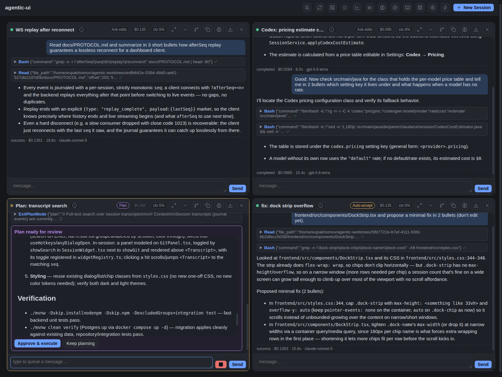
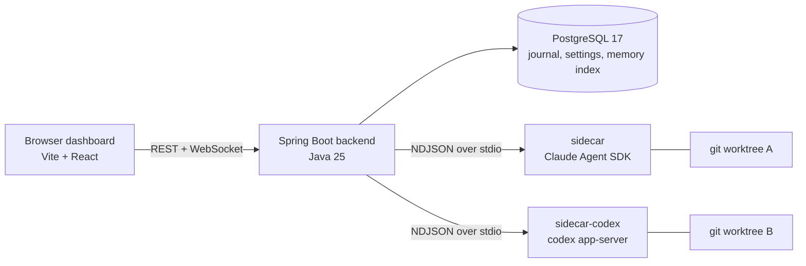

# Agentic Code Multi-Session Manager

[](https://github.com/eupakhomov/agentic-ui/actions/workflows/ci.yml)
[](LICENSE)

Run parallel AI coding-agent sessions — Claude Code and Codex — from one browser
dashboard. Each session works on its own git worktree, so four agents can hack on the
same repository at once without stepping on each other's branches. Everything is
journaled to PostgreSQL, so sessions survive backend restarts, laptop sleeps, and
browser reloads.



## Why

Working with one coding agent in one terminal is easy. Working with several at once —
a feature build here, a PR review there, a quick experiment on the side — turns into
branch collisions, lost terminal scrollback, and "which tab was that in?". This tool
gives every session its own worktree, its own sidecar process, and a persistent,
replayable transcript, with the human-in-the-loop controls (permission prompts, plan
approval, cost budgets) in one place.

The other half of the problem is the chores *around* the agents. With a few running,
most of your time goes to babysitting: creating and cleaning up worktrees, noticing
which agent is stuck on a permission prompt, checking whether a PR's CI went green,
writing commit messages for code you didn't type. The dashboard takes those over —
worktree lifecycle, desktop notifications when an agent needs input, finishes, or
crashes, background PR-check polling, AI-drafted commit messages and PR descriptions,
handoff briefs for picking a task up later — so your attention goes to the decisions,
not the plumbing.

It is deliberately a **single-user, LAN-deployment** tool: one token, no multi-tenant
auth, your own machine's `claude`/`codex`/`gh` credentials.

## Features

**Sessions**
- Parallel sessions, each in an isolated git worktree; idle sessions park (sidecar
  shut down) and wake transparently on the next message
- Two providers: **Claude Code** (Agent SDK — plan mode, auto-accept edits, subagents,
  thinking budgets) and **Codex** (app-server JSON-RPC — skills and MCP supported;
  per-turn cost estimated from an editable price table)
- Permission modes per session: ask, auto-accept edits, plan (with plan-approval
  cards), bypass; mode switchable at runtime from the widget
- Templates, quick-session dialog (service + branch + prompt), session duplication,
  continuation/handoff briefs, cost budgets, context-usage chips with one-click
  compaction, transcript export

**Review sessions**
- Point a session at an open PR (or plain branch): detached worktree at the PR head,
  commit/push/PR disabled in UI and API, findings submitted as a real GitHub review
  (summary + inline comments) through a human-gated approval card

**Routine operations**
- Worktree lifecycle: a fresh branch + worktree per session, removed on close (commit,
  stash, or discard the dirty state first); a usage dashboard lists idle sessions still
  holding a worktree on disk
- Desktop notifications for the sessions you aren't looking at: an agent needs your
  input (permission prompt), finished its turn, crashed, or its PR's CI passed/failed
- Git panel per session: status, diff, log, commit, push, PR creation — with commit
  messages and PR descriptions drafted by a cheap helper model — and background polling
  of the PR's checks
- Auto-titled sessions, keyboard-first UI with a hotkey cheatsheet, dark and light themes

**Around the sessions**
- Skill & agent library: import skills from local folders or GitHub repos, tag and
  AI-describe them, sync sources on a schedule, attach per session or template
- Long-term memory: an Obsidian-compatible Markdown vault with hybrid
  (dense + sparse) search, episodic memory injected into sessions, and opt-in
  end-of-session reflection (with approve/discard proposals)
- Linear integration: import a ticket into a ready-to-go session (branch name +
  kickoff prompt generated), and Linear MCP tools available inside sessions
- Code intelligence (one-of per install): [Serena](https://github.com/oraios/serena)
  symbolic tools or [graphify](https://github.com/Graphify-Labs/graphify)
  knowledge-graph tools, layered into sessions via MCP
- Ecosystem awareness: point the tool at a folder of services and sessions get
  read-only context of sibling repos; monorepo detection optional
- Orchestration: a session can spawn child sessions (fan-out) via an MCP tool

## Architecture



One sidecar process per live session, speaking a provider-neutral NDJSON protocol
(`docs/PROTOCOL.md`); provider specifics stay inside each sidecar. Every event gets a
monotonic per-session `seq`, journaled to Postgres — clients reconnect and replay
losslessly. The as-built details live in [`docs/ARCHITECTURE.md`](docs/ARCHITECTURE.md).

## Quick start

Prerequisites:

| Tool | Version | Notes |
|---|---|---|
| JDK | 25 (Temurin) | `mvn -v` must report Java 25 |
| Maven | 3.9+ | `brew install maven` / `sdk install maven`; no Maven? the bundled `./mvnw` works too |
| Node | ≥ 22 LTS | needed by the sidecars and frontend |
| Docker | any recent | PostgreSQL runs via `docker-compose.yaml` |
| provider CLI | at least one of `claude` / `codex`, logged in | sidecars use your own `~/.claude` / `~/.codex` credentials |
| gh CLI | logged in (optional) | PR creation, PR-check polling, review sessions, GitHub library imports |

```bash
git clone https://github.com/eupakhomov/agentic-ui.git
cd agentic-ui
docker compose up -d     # PostgreSQL (schema applied via Flyway on first start)
./restart.sh --full      # build backend + frontend, start, print URL + access token
```

Open the printed URL (default `http://localhost:8080`), paste the token, create a
session. The first build downloads a Node distro and runs `npm install` — expect it to
take a while once; later `./restart.sh` runs are fast (add `--full` again only when
frontend sources changed). `./start.sh` restarts without rebuilding.

For a proper install on a Mac — starting at login, LAN access, updating, the optional
integrations below with their exact install commands — follow
[`docs/DEPLOY.md`](docs/DEPLOY.md).

## Feature setup guides

Each opt-in feature is configured in the Settings dialog (persisted, no restart) or by
env var. **Setup** links go to the step-by-step section in `docs/DEPLOY.md`; **Design**
links go to the phase doc with the rationale and decisions:

| Feature | Setup | Design |
|---|---|---|
| Review sessions | none — pick type **Review** in the create dialog (needs `gh`, logged in) | [`phase-15-review-sessions.md`](docs/plan/phase-15-review-sessions.md) |
| Codex provider | `codex login` once; select provider `codex` per session/template, or make it the default in Settings → Sessions. Codex-only installs: the `claude` CLI isn't needed, but backend-initiated helper turns that need MCP tools (Linear ticket import, memory-tool flows) can't answer approval prompts on a Codex system session and will time out; plain helper tasks (auto-titles, commit-message drafts) work fine | [`phase-5.13-codex-provider.md`](docs/plan/phase-5.13-codex-provider.md) |
| Skill library | Settings → Skill library (roots, sync, optional vectorize) | [`phase-6-skill-library.md`](docs/plan/phase-6-skill-library.md) |
| Long-term memory & reflection | Settings → Memory; vault root via `AGENTIC_UI_MEMORY_ROOT` | [`phase-5.3-memory-reflection.md`](docs/plan/phase-5.3-memory-reflection.md) |
| Semantic search (memory + library) | `AGENTIC_UI_VOYAGE_API_KEY` env var; unset = sparse-only search, everything else works — [DEPLOY §8a](docs/DEPLOY.md#8a-optional-semantic-search-voyage-embeddings) | `docs/ARCHITECTURE.md` §3a/§3b |
| Linear integration | `AGENTIC_UI_LINEAR_API_KEY` env var, or the OAuth toggle in Settings → Linear for SSO-gated accounts — [DEPLOY §8](docs/DEPLOY.md#8-optional-linear-ticket-import) | [`phase-12-linear-cache-serena-context.md`](docs/plan/phase-12-linear-cache-serena-context.md) |
| Code intelligence: Serena | `uv` + a local Serena checkout; Settings → MCP servers → Serena root, pick `Serena` in the selector; tick **Code intelligence** per session — [DEPLOY §8b](docs/DEPLOY.md#8b-optional-serena-symbolic-code-tools) | [`phase-12-…`](docs/plan/phase-12-linear-cache-serena-context.md) track B |
| Code intelligence: graphify | `uv` + a graphify checkout at the reviewed commit; Settings → MCP servers → Graphify root (first save syncs the env), pick `Graphify`; tick **Code intelligence** per session. One tool per install — the selector picks Serena *or* graphify — [DEPLOY §8c](docs/DEPLOY.md#8c-optional-graphify-knowledge-graph-code-tools) | [`phase-13-graphify.md`](docs/plan/phase-13-graphify.md) |
| PR checks polling | on by default; Settings → PR checks (interval); uses ambient `gh` auth | `docs/ARCHITECTURE.md` |
| Ecosystem / service discovery | Settings → Sessions → Ecosystem root; monorepo detection is a separate toggle | [`phase-8-service-discovery.md`](docs/plan/phase-8-service-discovery.md), [`phase-11-monorepo.md`](docs/plan/phase-11-monorepo.md) |
| Orchestration (child sessions) | none — agents get a `spawn_child_session` tool | [`phase-7-ux-and-orchestration.md`](docs/plan/phase-7-ux-and-orchestration.md) |

## Configuration

The most common knobs (all env vars are read at backend startup):

| Env var | Default | Purpose |
|---|---|---|
| `AGENTIC_UI_TOKEN` | — | dashboard/API token (required for non-loopback binds); `restart.sh` generates a random one each run if unset, or reuses a pre-exported value so it stays stable across restarts |
| `AGENTIC_UI_REPO` | this repo | default service repo (per-session selectable) |
| `AGENTIC_UI_WORKTREE_ROOT` | `~/agentic-worktrees` | where session worktrees live |
| `AGENTIC_UI_MAX_SESSIONS` | `4` | concurrent live sidecars (parked sessions don't count) |
| `AGENTIC_UI_IDLE_PARK_MINUTES` | `30` | idle minutes before a session parks |
| `AGENTIC_UI_DB_PASSWORD` | `agentic_ui` | Postgres password override |
| `AGENTIC_UI_VOYAGE_API_KEY` | — | enables dense/semantic search (secret — env only) |
| `AGENTIC_UI_LINEAR_API_KEY` | — | enables Linear import + MCP (secret — env only) |

The full list of limits, persisted settings, and operational notes is in
[`CLAUDE.md`](CLAUDE.md) — which doubles as the contributor/agent handbook for this
repo. Per-session limits (cost budget, max turns, thinking budget) are set in the
create dialog.

## Contributing

Contributions are welcome — bug reports, feature ideas, and PRs alike. Please read
[`CONTRIBUTING.md`](CONTRIBUTING.md) first: the project moves phase by phase with
design docs in `docs/plan/`, and the decision log there
([`docs/plan/README.md`](docs/plan/README.md)) records the architectural choices that
are already settled.

## License

[Apache 2.0](LICENSE)
